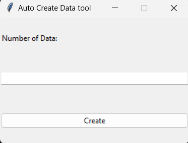
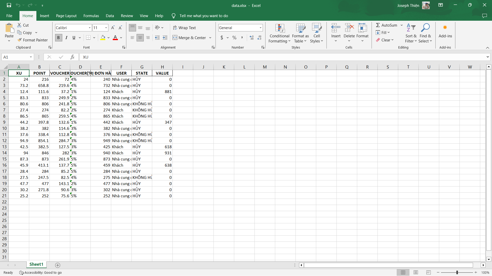

# TẠO DỮ LIỆU TỰ ĐỘNG HOÁ BẰNG EXCEL VỚI CÔNG CỤ PYTHON (TKINTER, OPENPYXL, PANDAS)

Trong thời đại hiện nay, khi công nghệ tiên tiến vượt bậc với sự ra đời của internet, mọi thứ đều trở nên dễ dàng hơn. Và để có thể tạo ra các dữ liệu tự động hoá, chúng ta cần phải có một cách để tạo ra các dữ liệu tự động hoá. Để làm được điều này, chúng ta sẽ sử dụng công cụ Python.

## Tạo dữ liệu tự động hoá bằng Python

Đầu tiên chúng ta sẽ có 2 file code:
- main.py: giao diện UI.
- AutoCreateDataWithExcel.py: tạo các hàm tự động tạo dữ liệu.

## Sử dụng source code
### Tải thư viện

Để có thể thao tác được với excel, giao diện người dùng cũng như tạo dữ liệu tự động, chúng ta sẽ sử dụng 03 thư viện: Tkinter, Openpyxl và Pandas.

Chúng ta sẽ nhập dòng lệnh như sau:

**Thư viện Pandas:**
```
pip install pandas
```

**Thư viện Openpyxl:**
```
pip install Openpyxl
```

**Thư viện Tkinter:**
```
pip install Tkinter
```

### Chạy source code

Sau khi  tải các thư viện xong, chúng ta sẽ mở file main.py và nhấn nút **RUN**

Chúng ta sẽ ra giao diện như sau:



Tiếp theo, chúng ta sẽ nhập số dòng dữ liệu cần thiết và nhấn nút **CREATE**

Và chúng ta sẽ nhận được file excel tự động tạo ra:




Hoàn tất chương trình. Nếu bạn muốn nhập nhiều hơn, cứ việc tăng số dòng dữ liệu bạn mong muốn. Quan trọng là máy bạn có đủ dung lượng để lưu trữ hay không thôi.